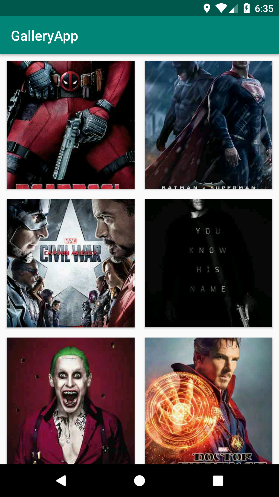

# GalleryApp
A simple gallery app using Glide,Volley library.Images are downloaded from Url using JSON and set in recyclerview.Fullscreen image slider is also added.

**Third party libraries used:**
   
   * [Volley](https://developer.android.com/training/volley)
   * [Glide](https://github.com/bumptech/glide)
   * [Picasso](https://github.com/square/picasso)
   * [Butterknife](https://github.com/JakeWharton/butterknife)

**Here are the screenshots:**

